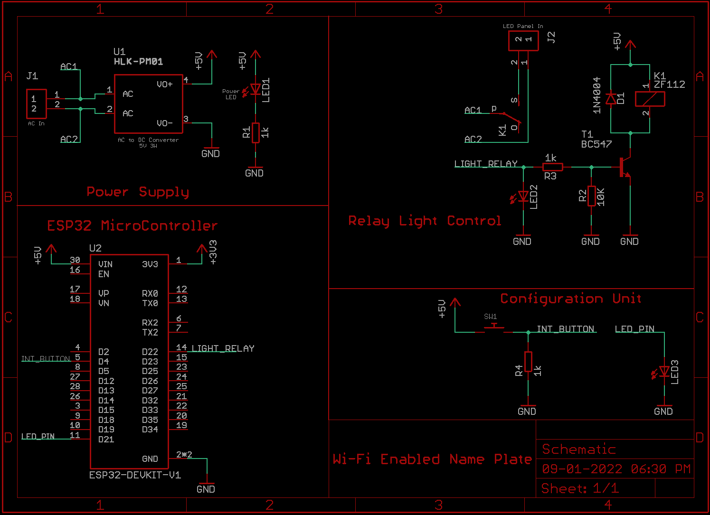

# Automatic Name & Address Plate for House

## What the Project does?

I always wanted a glowing address plate for my house. Buy alas, I was born lazy !! I hate to turn ON and OFF the lights of my address plate for my house everyday. So, I have created an automatic address plate which turns the backlight ON/OFF on the programmed time. The base microcontroller used is ESP32 which connects to my home Wifi. After connecting to Wifi, it contacts the NTP server and updates it current time.

## Features
- Flexible On/Off Control. A single button press will initiate a WebServer which can be used to configure the SSID, Password, ON/OFF Time.
- AC Powered LED Control Board.
- Easy to use and configure.

---

## How the device works?

### Sleep Duration

- If current time is less than Backlight start time, it sleeps for half the remaining time. After waking up, it does the same process until current time equals set start time.

### Turn On Duration

- If current time is greater than Backlight start time but less than Backlight stop time, it creates a delay for half the remaining time. This process continues till stop time is reached.

---
### Warning: This project uses AC Supply. Please take care to not electrocute yourself.

## How to use this project?
1. Assemble the circuit as per the schematic mentioned below.
2. Load the firmware on ESP32-Devkit-V1.
3. As soon as the firmware is loaded and device is powered up, press the configuration push button.
4. After the Webserver is launched, login the credentials of your SSID, Password and ON/OFF Time.
5. Connect the Live Wires to "AC IN" Port.
6. Connect the LED Panel to "LED IN" Port.
7. Edit the fusion 360 file with your details available in Hardware folder.
8. 3D Print the model and assemble the hardware after fitting the circuit and LED Panel inside.
9. Seal all circuit to avoid any contact to water.

### Schematic Diagram

  
 And ladies and gentlemen, you have a Automatic Name Plate for your house.

P.S. You can edit this project to control any timed device such as a coffee maker or your cloth iron if you are forgetful like me.
 

## Bill of Materials
| Component | Buy Link | Quantity |
|-----------|----------|----------|
|HLK-PM01 Hi-link - 5V 3W - AC to DC Power Supply Module|https://www.electronicscomp.com/hi-link-hlk-pm01-5v-3w-power-supply-module-india?search=hi%20link%205v%203w|1|
|2 Pin 2.54mm Pitch Pluggable Screw Terminal Block|https://www.electronicscomp.com/2-pin-2.54mm-pitch-pluggable-screw-terminal-block?search=block%20terminal|2|
|ESP32 Development Board with Wifi and Bluetooth|https://www.electronicscomp.com/esp32-development-board-with-wifi-bluetooth-india?gclid=Cj0KCQiAt8WOBhDbARIsANQLp96zpUuA8HpuH7S96OZagtNDjNtOvTlIla7blWfk2N-OulVYsAGfCeAaAj9DEALw_wcB|1|
|Blue LED - 3mm|https://www.electronicscomp.com/blue-led-3mm-clear?search=3%20mm%20led|3|
|1K ohm Resistor - 1/2 Watt|https://www.electronicscomp.com/1k-ohm-half-watt-resistance?search=1k%20resistor|3|
|10K ohm Resistor - 1/2 Watt|https://www.electronicscomp.com/10k-ohm-half-watt-resistance?search=10k%20resistor|1|
|PCB Mount Relay - SPDT|https://www.electronicscomp.com/5v-10a-pcb-relay?search=relay&sort=p.price&order=ASC|1|
|Push Button Switch 2 Pin - 5mm|https://www.electronicscomp.com/push-button-switch-2-pin-5mm?search=push%20button|1|

---
#### Developed for: Self Use
#### Developed by: Parth Patel [parth.pmech@gmail.com](mailto:parth.pmech@gmail.com)

 

## Tools Used:

